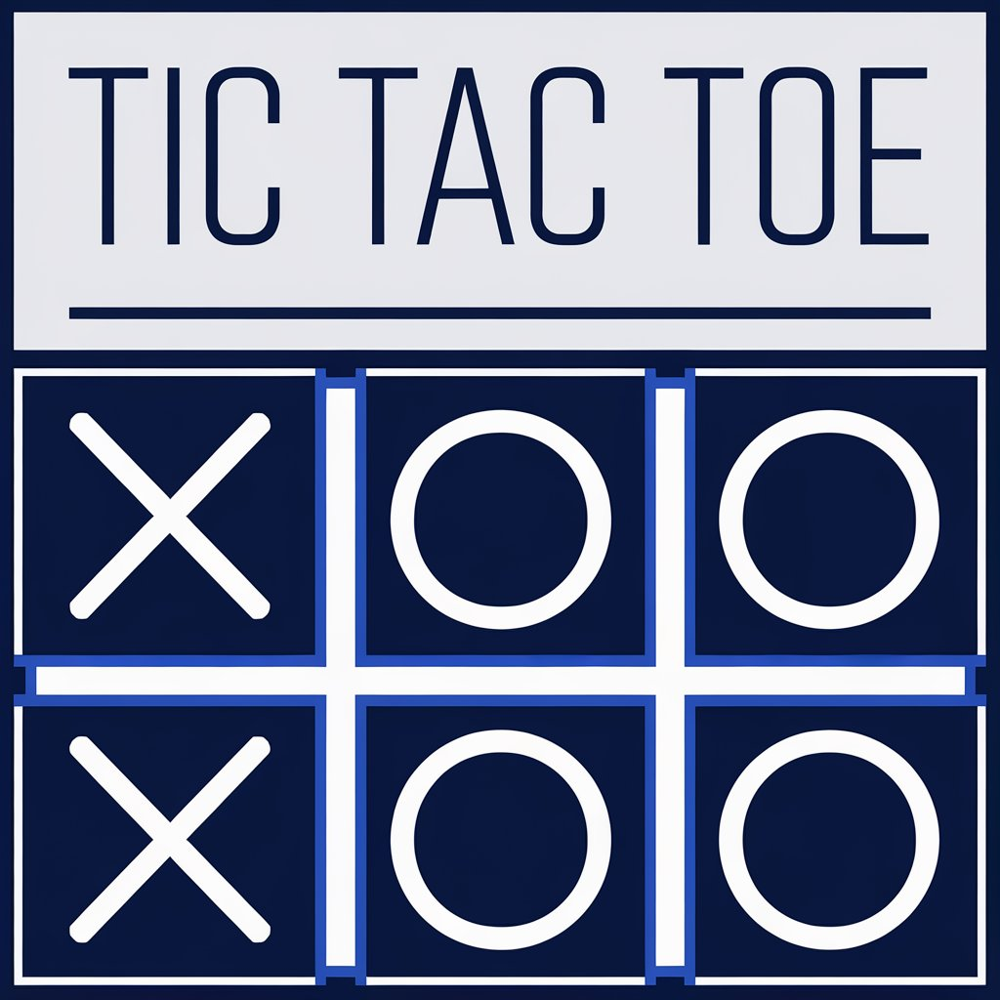
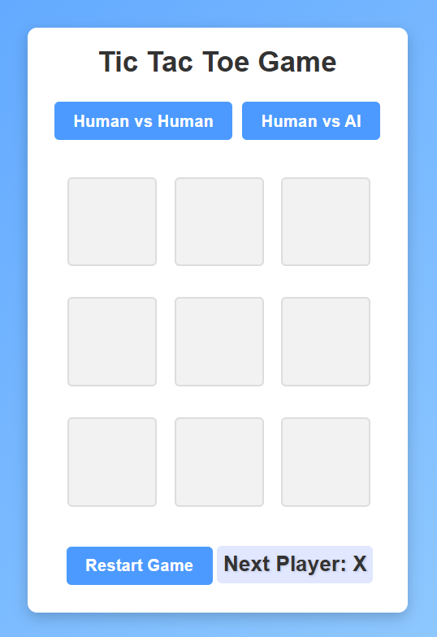

**Tic-Tac-Toe Game** 🎮



Welcome to the Tic-Tac-Toe Game project! This app lets you play a classic Tic-Tac-Toe game against another player or challenge an AI. Built with React, this project showcases core React concepts like state, props, and conditional rendering while keeping the experience fun and interactive.

🎯 Features:

- Two Game Modes: Play Human vs. Human or Human vs. AI.
- Instant AI Move: The AI makes its move immediately after yours.
- Smart UI: Interactive buttons and smooth animations enhance the experience.
- Responsive Design: Optimized for desktop and mobile screens.

🚀 Demo
Try the live version of the game here: [Tic-Tac-Toe Game](https://deepakpatil26.github.io/react_tic-tac-toe)

## Live Demo

You can try out the project live on CodeSandbox: [Live Demo on CodeSandbox](https://codesandbox.io/p/sandbox/react-tic-tac-toe-pfjd3t)

🖼️ Screenshot:



📦 Installation
If you'd like to run this project locally:

1. Clone this repository:

```bash

git clone https://github.com/deepakpatil26/react_tic-tac-toe.git
```

2. Navigate into the project directory:

```bash

cd react_tic-tac-toe
```

3. Install dependencies:

```bash

npm install
```

4. Start the development server:

```bash

npm start
```

🔍 How to Play:

- Choose the game mode by selecting Human vs Human or Human vs AI.
- In Human vs Human, both players take turns by clicking on squares.
- In Human vs AI, make your move and watch the AI respond immediately.
- Click Restart Game to play a new game.

🛠️ Technologies Used

- React: This is used to build the interactive user interface.
- CSS: For styling and animations.

🧠 How It Works

- The game maintains the board’s state in an array of nine squares.
- Game logic checks for a winner after each move and the game resets once a winner is declared.
- In Human vs AI mode, a basic AI algorithm picks the first available move after the player moves.

📜 License
This project is licensed under the MIT License - see the LICENSE file for details.

👥 Contributing
Contributions are welcome! If you'd like to make the AI smarter, improve UI/UX, or add new features, feel free to submit a pull request.
